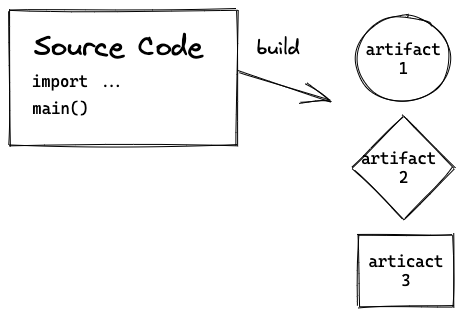
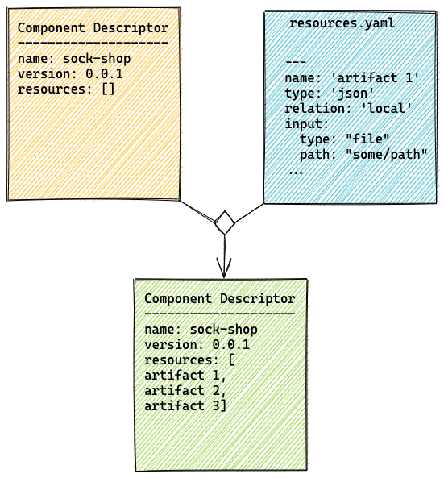
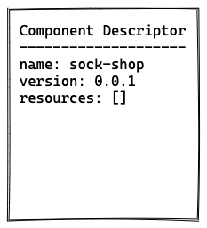

# OCM Development Workflows

## 1 Initial Component Descriptor

The first workflow describes the initial creation of a BOM as component descriptor.
Reference-style:


### 1.1 create a Component descriptor with resources



#### 1.1.1 create a Component Descriptor skeleton

Create a Component Archive Skeleton with the [component-cli](https://github.com/gardener/component-cli/tree/main/docs)

```bash
landscaper-cli component-cli component-archive create ./sock-shop --component-name "github.com/gardener/landscaper-examples/manifest-deployer/sock-shop" --component-version "v0.0.1"

```


The created component-descriptor.yaml now contains component's name and version.

```yaml
component:
  componentReferences: []
  name: github.com/gardener/landscaper-examples/manifest-deployer/sock-shop
  provider: internal
  repositoryContexts: []
  resources: []
  sources: []
  version: v0.0.1
meta:
  schemaVersion: v2
```

### 1.1.2 add resources

Create a resources.yaml of components

```yaml
---
name: 'carts'
version: '0.0.1'
type: 'ociImage'
relation: 'external'
access:
  type: 'ociRegistry'
  imageReference: 'weaveworksdemos/carts:0.4.8'
...
---
name: 'mongo'
version: '0.0.1'
type: 'ociImage'
relation: 'external'
access:
  type: 'ociRegistry'
  imageReference: 'mongo'
...
```

add the resources with the command

```bash
landscaper-cli component-cli component-archive resources add ./sock-shop ./resources.yaml
```

## 2. Deploy execution (landscaper blueprint)
