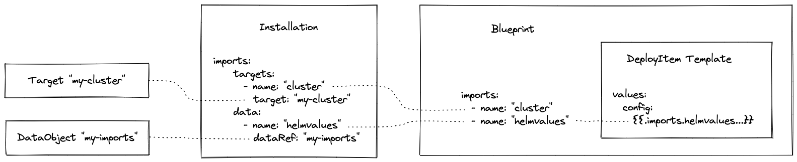

# Deploying a Helm Chart with Landscaper

The [blueprint](./blueprint) in this example deploys a helm chart. 
Chart and image are specified in the [component descriptor](./component-descriptor.yaml).

The blueprint does not contain helm values for a specific installation, nor information about the target cluster.
Rather it has import parameters so that these data can be provided from outside.

The kubeconfig of the target cluster is stored in a [Target](./installation/target.yaml) custom resource.

The helm values are stored in a [DataObject](./installation/imports.yaml) custom resource. 
Alternatively, values could be provided in ConfigMaps or Secrets.

The [installation](./installation/installation.yaml) connects all this. It references the blueprint, and it binds each 
of its import parameters to a Target or DataObject.

