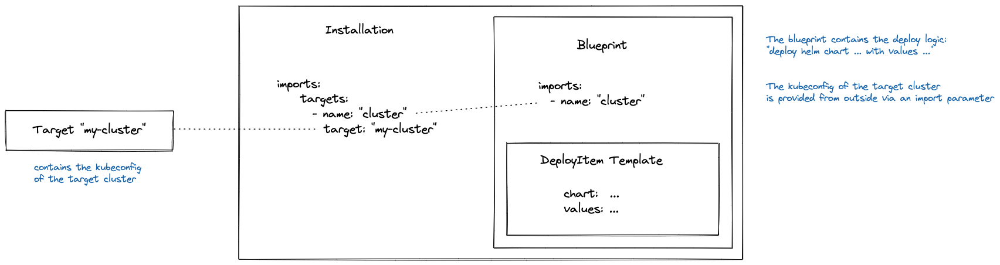
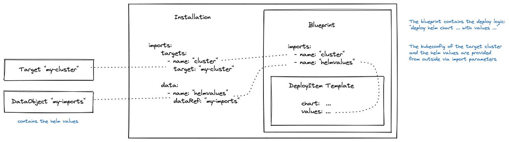

# Examples with Inline Blueprint

### Example [installation-1](installation-1)

This installation in this example deploys a helm chart.
The blueprint of the installation is defined inline.

- The [installation](installation-1/installation.yaml) contains the helm chart data and helm values in an inline blueprint.
- The [target](installation-1/target.yaml) contains the kubeconfig of the target cluster.
- The [context](installation-1/context.yaml) contains the access data for the helm chart repo.

### Example [installation-2](installation-2)

Similar to the previous example. The helm values are now imported from a data object.

- The [installation](installation-2/installation.yaml) contains the helm chart data in an inline blueprint.
  The helm values are imported from a data object.
- The [target](installation-2/target.yaml) contains the kubeconfig of the target cluster.
- The [context](installation-2/context.yaml) contains the access data for the helm chart repo.
- The [**data object**](installation-2/imports.yaml) contains the helm values.

### Example [installation-3](installation-3)

Similar to the previous example. The helm values are now imported from a secret.

- The [installation](installation-3/installation.yaml) contains the helm chart data in an inline blueprint.
  The helm values are imported from a secret.
- The [target](installation-3/target.yaml) contains the kubeconfig of the target cluster.
- The [context](installation-3/context.yaml) contains the access data for the helm chart repo.
- The [**secret**](installation-3/imports.yaml) contains the helm values.

### Example [helm/installation-4](installation-4)

Similar to the second example.  
The installation contains additionally an inline component descriptor.  

- The [installation](installation-4/installation.yaml) contains inline a **component descriptor** and a blueprint. 
  The helm chart and the container image are resources in the component descriptor. 
  The blueprint references the resources in the component descriptor.
  The helm values are imported from a data object. 
- The [target](installation-4/target.yaml) contains the kubeconfig of the target cluster.
- The [context](installation-4/context.yaml) contains the access data for the helm chart repo.
- The [data object](installation-4/imports.yaml) contains the helm values.

