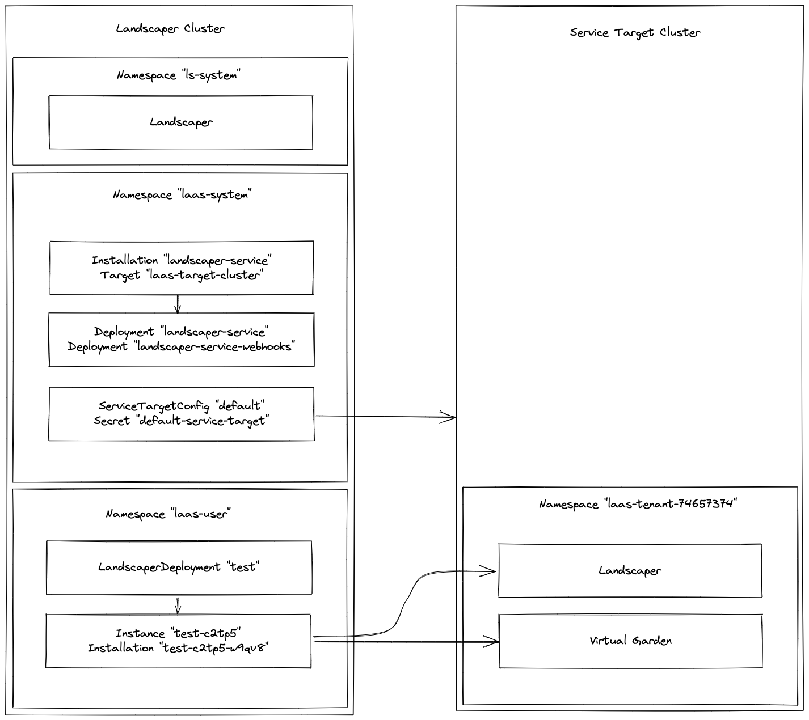

# Installation of the Landscaper Service

> UNDER CONSTRUCTION !

Scripts for the installation of the Landscaper as a service.

[LAAS documentation](https://github.com/gardener/landscaper-service/tree/main/docs)

- Prerequisite: a landscaper must be installed on the laas cluster.
- Set the properties in the settings file.
- Execute script [01-install-laas.sh](./01-install-laas.sh)
- Execute script [02-create-service-target.sh](./02-create-service-target.sh)
- Execute script [03-create-landscaper-deployment.sh](./03-create-landscaper-deployment.sh)

