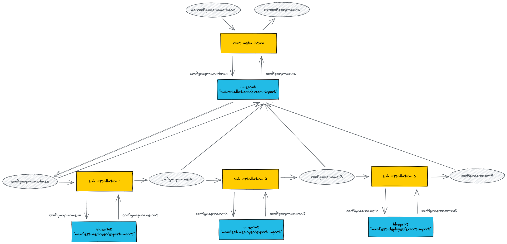

# Subinstallations

> The present example is variant of [version v0.1.2](../v0.1.2). It has one additional subinstallation.

The blueprint in this example has three subinstallations.
Each subinstallation uses the blueprint of example 
[manifest-deployer/export-import](../../manifest-deployer/export-import)
that creates a configmap.

Each subinstallations imports the name of the configmap that it creates (import parameter `configmap-name-in`)
and exports a slightly modified name (export parameter `configmap-name-out`) which serves as import for the next
subinstallation.

The root installation exports the list of all configmap names. 

The following diagram shows the data flow. (The parameter for the target is omitted.)

